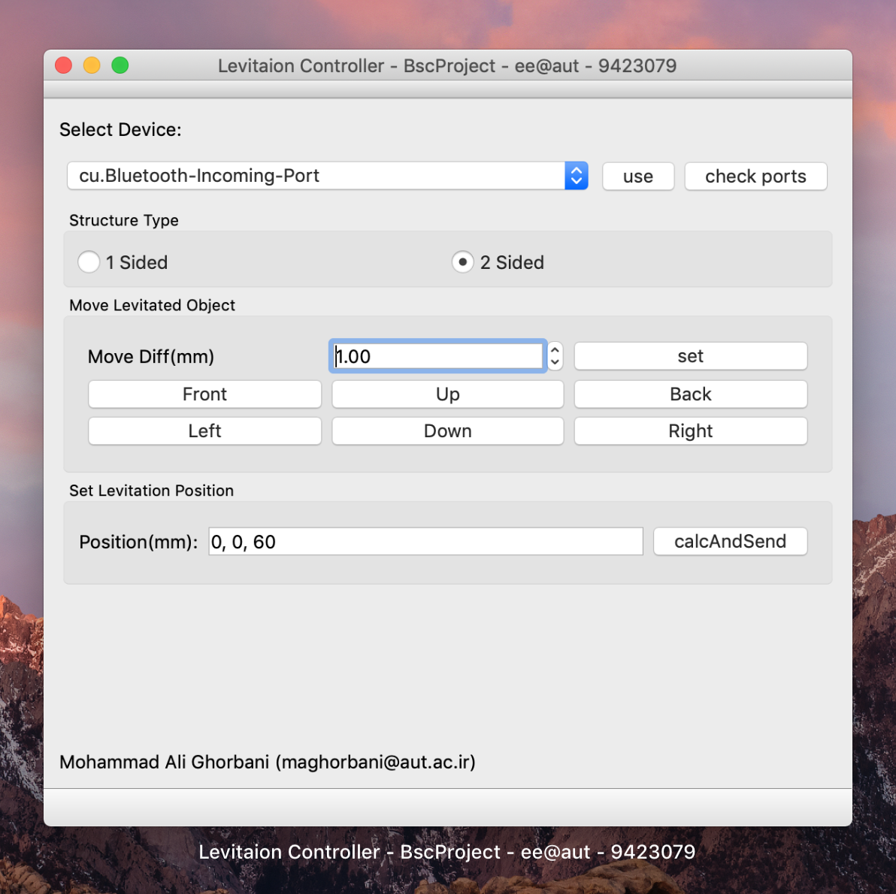

## Levitated Object Controller


* Deps:
  * Qt5 [i used 5.13.0 version clang_64]
  * [spdlog](https://github.com/gabime/spdlog) [i used v1.8.0] 
  * Arduino IDE 1.6.13

CMake Configs:

*you can add deps path in your environment path variable and not mention this cmake flag in your configurations*

```cmake
-DCMAKE_PREFIX_PATH=path/to/Qt5;path/to/spdlog
```

### How to build

```bash
git clone https://github.com/maghorbani/LevController
cd LevController
mkdir build && cd build
cmake .. \
	-DCMAKE_PREFIX_PATH=[mentioned above]
make
```

#### How it looks like




### First Step: Prepare Hardware

the electronic implementation is using ArduinoMEGA

please prepare an ArduinoMEGA 2560 and using Arduino IDE, programm the LevControllerDriver/LevControllerDriver.ino file into the Arduino

*please note that i used Arduino IDE 1.6.13 and in the higher versions, some optimizations in compile steps, will make the hardware not to work in 40KHz but in lower frequencies*

*so best choice is to use Arduino IDE 1.6.13 and an alternative choice is to compile with -o 3 flag in higher version*

*you can find Arduino IDE 1.6.13 download link [here](https://www.arduino.cc/en/main/OldSoftwareReleases).*

### How to use is:

* use action **File>Load Struct ([CMD] + O)** and load a json structure file

* connect the ArduinoMEGA throgh usb and hit **check ports** button, and the application will fill the combobx with all connected Serial Devices.

  Select the considered port and hit **use** button

* in **set Levitation Point** section, specify an initial location based your structure and click **calcAndSend** button

* now you can place a particle in your specified location and the structure will Levitate The point

* after Levitation, you can play around with **Move Levitated Object** section; by hitting any of direction buttons, the levitated object will move in that direction, with location change specified in **Move Diff**

*This Project is done as Bs.c Project in AmirKabir University of technology, Electronics Branch*

*maghorbani@aut.ac.ir -> you can send me anything about this project*